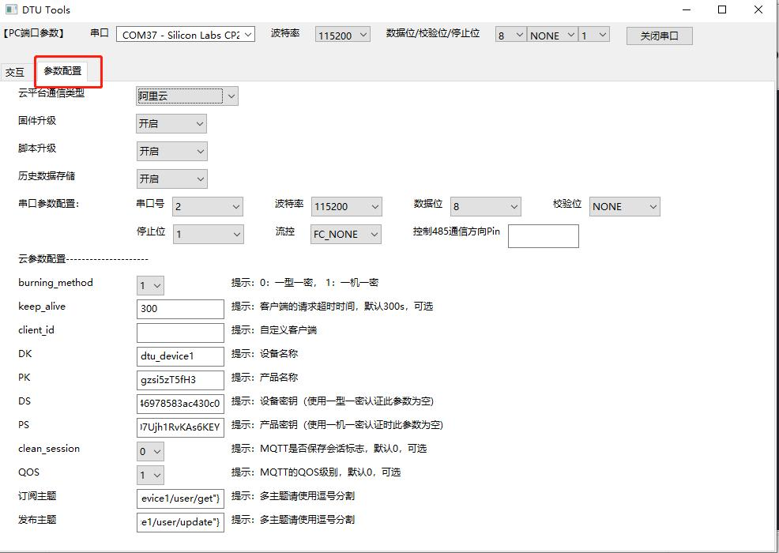
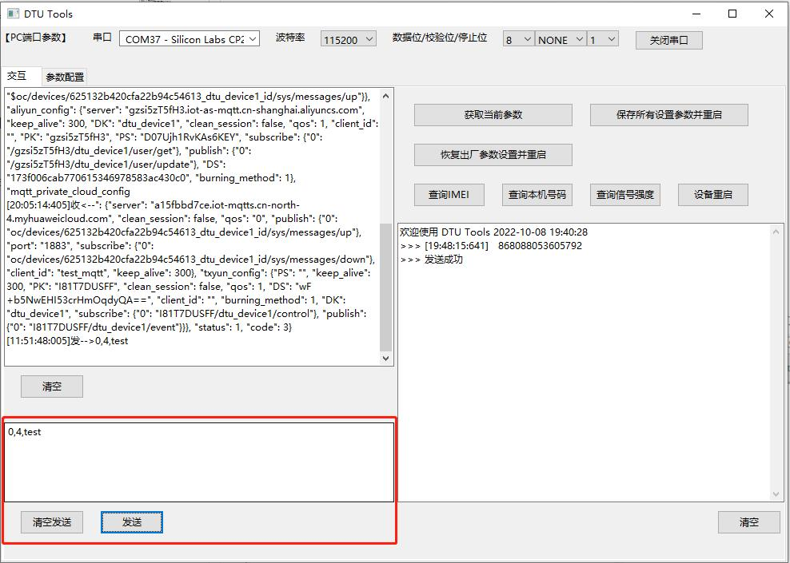

# **DTU GUI工具使用说明**

## 1.基本概述

本文档主要介绍DTU GUI工具的使用。

DTU GUI工具现阶段主要为客户开发调试使用，DTU GUI工具提供基础的查询与设置功能，以及模拟MCU测试和DTU模块数据收发，用户可使用USB to TTL模块连接PC与DTU。

DTU GUI基于wxPython开发，现阶段已编译的dtu_gui.exe仅支持Windows系统，
用户在Linux/macOS配置Python环境并安装wxPython lib后可直接运行dtu_gui.py或自行编译对应版本的exe程序。

## 2. 运行DTU GUI 工具

**双击打开DTU GUI工具**

**打开串口**

## 3. DTU GUI 功能介绍

## 3.1 工具箱

**目前工具箱的功能如下：**
| **按键名** | **功能** |
| ---------- | -------- |
| **获取当前参数** | 获取DTU当前配置参数，并跳转到`参数配置`界面中显示具体参数 |
| **保存所有设置参数并重启** | 将当前`参数配置`界面中配置参数写入DTU，并重启DTU |
| **恢复出厂参数设置并重启** | 删除所有配置参数，恢复出厂参数，并重启DTU |
| **查询IMEI号** | 获取DTU模组IMEI号 |
| **查询本机号码** | 获取DTU中SIM卡手机号码 |
| **查询信号强度** | 获取csq信号强度，信号强度值范围0 ~ 31，值越大表示信号强度越好 |
| **设备重启** | 重启DTU设备 |

### 3.1.1 查询IMEI号：

- 查询IMEI号：

在左侧串口数据显示框中以字符串格式显示出详细地串口数据，右侧命令消息框显示出查询获得的IMEI号。

### 3.1.1 获取DTU当前配置参数：

点击`获取当前参数`按钮后，立即跳到参数配置界面。

点击交互界面可以看到工具和DTU具体交互串口信息。

## 3.3 导入配置参数
读取当前配置参数后，进入参数配置界面，可以根据实际需求修改配置（也可以不读取，直接填写配置）。
### 3.3.1基本参数配置

基本配置参数项如上图
| **参数名** | **含义** |
| ---------- | -------- |
| 云平台通道类型 | 云平台选择，可选项：`阿里云`、`腾讯云`、`华为云`、`移远云`、`TCP私有云`、`MQTT私有云`|
| 固件升级 | 是否开启固件OTA升级|
| 脚本升级 | 是否开启项目脚本OTA升级|
| 历史数据存储 | 当通信异常，DTU无法向云端发送数据时，将发送数据保存，待通信恢复正常后重新发送|
| 串口号 | 外部MCU连接DTU串口号，可选项：`0`，`1`，`2`|
| 波特率 | 串口波特率|
| 数据位 | 奇偶校验|
| 停止位 | 停止位长度，可选项：`1`，`2`|
| 流控 | 硬件控制流，可选项：`FC_NONE`，`FC_HW`|
| 控制485通信方向Pin | 串口发送数据之前和之后进行拉高拉低指定GPIO，用来指示485通信的方向。如`1`、 `2`代表`UART.GPIO1`、`UART.GPIO2`。

### 3.3.2 云参数配置
云参数配置项会根据基本`云平台通信类型`选择值变化。当`云平台通信类型`为阿里云时，云参数配置项如下：

当`云平台通信类型`为移远云时，云参数配置项如下：

## 3.4 数据发送框的格式要求
数据发送的格式与MCU和DTU通信格式一致。针对和云端通信协议的不同，模块和外部设备（如MCU）通信协议也会不同。当模块和云端通信使用TCP协议时，由于TCP和串口都是数据流的形式，所以直接透传数据，不做任何处理；当模块和云端通信使用MQTT协议时，为了区分不同的数据帧，模块的串口对外协议采用简单的数据帧：
`<topic_id>,<msg_len>,<msg_data>"`。
**注：移远云不支持Topic设置，`<topic_id>`统一为`"0"`**

**示例报文：**

- 上行报文：

`“1,6,abcedf”`

- 下行报文：

`“1,6,2584251182,ijklmn”`

模块和外部设备（MCU）上行报文和下行报文都是采用字符串可是，数据项之间采用`,`相隔。

